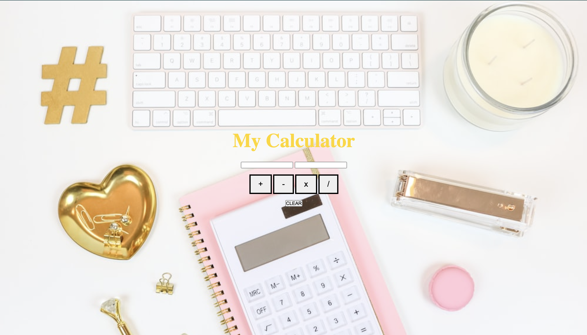

This project is to create a simple calculator using four buttons. 

How It's Made Tech Used:

<ul>
<li>HTML</li>
<li>CSS</li>
<li>JavaScript</li>

Optimizations: The improvements I made were to add CSS to make it look styled with color.

Lesson Learned: I learned how to build the simple calculator using HTML, CSS and using JavaScript as the functionality. 